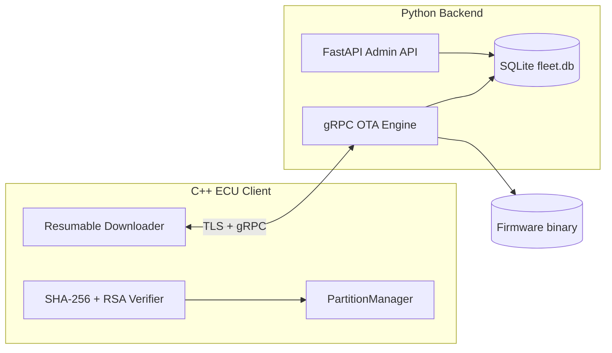

# AutoGuard-OTA

Simulated secure Over-The-Air (OTA) firmware update platform for automotive ECU fleets. AutoGuard-OTA models patterns used in embedded and automotive systems: resumable downloads, cryptographic verification, TLS transport, cohort-based rollouts, and A/B partition swapping with rollback.

> **Note:** This is a simulation project — not deployed to real vehicles or production ECUs.

## Features

- **Dual-layer firmware verification** — SHA-256 integrity check plus RSA signature validation before install
- **TLS-secured gRPC** — encrypted transport between ECU client and OTA server
- **Resumable streaming downloads** — chunked firmware transfer with resume-after-interrupt (simulated network drop)
- **A/B partition management** — flash to inactive bank, boot-and-commit, automatic rollback on failure
- **Cohort-based rollouts** — target updates to device groups (e.g. `beta` vs `general`) via SQLite-backed campaigns
- **Admin control plane** — FastAPI REST API with Swagger UI for fleet visibility and campaign management
- **CI/CD** — GitHub Actions pipeline with cross-language build and end-to-end integration tests

## Architecture



| Component | Role |
|-----------|------|
| **C++ Edge Client** | Checks for updates, downloads firmware, verifies hash + signature, flashes inactive partition |
| **Python gRPC Engine** | Campaign matching, firmware signing, chunked streaming, simulated network interruption |
| **Admin API (FastAPI)** | Fleet status, campaign CRUD, Swagger docs at `/docs` |
| **SQLite** | Device registry, cohort membership, rollout campaigns |

## Tech Stack

C++17 · Python 3.12 · gRPC · Protocol Buffers · FastAPI · OpenSSL · SQLite · Docker · GitHub Actions · CMake

## Prerequisites

**Linux or macOS recommended** (WSL2 works on Windows).

| Tool | Purpose |
|------|---------|
| Python 3.12+ | Server, admin API, tests |
| CMake 3.15+ | Build C++ client |
| gRPC / Protobuf dev libs | C++ client compilation |
| OpenSSL CLI | Generate TLS certs and signing keys |

**Ubuntu / Debian system packages:**

```bash
sudo apt-get update
sudo apt-get install -y build-essential cmake libgrpc++-dev \
  protobuf-compiler-grpc protobuf-compiler libprotobuf-dev libssl-dev openssl
```

## Local Setup

### 1. Clone and install Python dependencies

```bash
git clone https://github.com/raman15-glitch/AutoGuard-OTA.git
cd AutoGuard-OTA

python3 -m venv venv
source venv/bin/activate        # Windows (PowerShell): .\venv\Scripts\Activate.ps1
pip install -r server/requirements.txt
```

### 2. Generate TLS and signing keys

```bash
mkdir -p keys

# TLS certificate for gRPC (RSA-4096)
openssl req -x509 -newkey rsa:4096 -nodes -days 365 \
  -keyout keys/server.key \
  -out keys/server.crt \
  -subj "/CN=localhost"

# RSA keypair for firmware signing (RSA-2048)
openssl genrsa -out keys/private.pem 2048
openssl rsa -in keys/private.pem -pubout -out keys/public.pem
```

> Keys are gitignored. Regenerate locally or let CI create ephemeral keys in the pipeline.

### 3. Create mock firmware payload

```bash
mkdir -p server/firmware
head -c 10485760 </dev/urandom > server/firmware/v2.0.bin
```

The server serves `server/firmware/v2.0.bin` during OTA downloads (~10 MB).

### 4. Build the C++ client

```bash
cd client
mkdir -p build && cd build
cmake -DCMAKE_PREFIX_PATH=/usr ..
make
cd ../..
```

This produces `client/build/ota_client`.

## Running Locally

Open **three terminals** from the project root.

**Terminal 1 — Admin API:**

```bash
cd server/src
uvicorn admin_api:app --host 127.0.0.1 --port 8000
```

Swagger UI: [http://localhost:8000/docs](http://localhost:8000/docs)

**Terminal 2 — gRPC OTA server:**

```bash
python3 server/src/server.py
```

**Terminal 3 — Run a simulated vehicle:**

```bash
cd client/build
export SERVER_HOST="localhost:50051"
export DEVICE_ID="TSLA-999"    # beta cohort — eligible for seeded v2.0 campaign
./ota_client
```

### Expected behavior

| Device ID | Cohort | Seeded campaign | Result |
|-----------|--------|-----------------|--------|
| `TSLA-999` | `beta` | v2.0 active | Update offered |
| `RIVN-404` | `general` | none (by default) | No update |
| `FORD-101` | `general` | none (by default) | No update |

On first download, the server simulates a network drop (~5 MB). Run the client again to resume, verify, and complete the partition swap.

### Create a rollout via Admin API

```bash
curl -X POST http://localhost:8000/campaigns \
  -H "Content-Type: application/json" \
  -d '{"target_version": "3.0", "target_cohort": "general", "is_active": true}'
```

Then run a general-cohort device:

```bash
export DEVICE_ID="RIVN-404"
./ota_client
```

## Running Tests

With servers **not** already running, from the project root:

```bash
# Start services in background
cd server/src && uvicorn admin_api:app --port 8000 &
python3 server/src/server.py &
sleep 3

# Run E2E suite (builds on CI; requires ota_client in client/build)
pytest server/tests/test_e2e.py -v -s
```

The E2E test verifies:

1. Campaign creation via FastAPI
2. Simulated network interruption on first download
3. Resume from partial file
4. SHA-256 checksum validation
5. RSA signature verification
6. A/B partition swap via `PartitionManager`

**Partition unit test (optional):**

```bash
cd client/build
cmake .. && make test_partition
./test_partition
```
## Project Structure

```
AutoGuard-OTA/
├── proto/ota.proto              # gRPC service definition
├── client/
│   ├── src/main.cpp             # ECU client (download, verify, flash)
│   ├── src/partition_manager.*  # A/B bank swap + rollback
│   └── CMakeLists.txt
├── server/
│   ├── src/server.py            # gRPC OTA engine (TLS, signing, streaming)
│   ├── src/admin_api.py         # FastAPI control plane
│   ├── src/database.py          # SQLite schema + campaign logic
│   └── tests/test_e2e.py        # Integration tests
├── .github/workflows/ci.yml     # Build + E2E on push/PR
├── docker-compose.yml
└── keys/                        # gitignored — generate locally
```

## CI/CD

On every push or pull request to `main`, GitHub Actions:

1. Installs Python and C++ dependencies
2. Generates ephemeral TLS + RSA keys
3. Creates mock firmware binaries
4. Compiles the C++ client
5. Starts Admin API + gRPC server
6. Runs `pytest server/tests/test_e2e.py`

## Roadmap

- [ ] Campaign pause / kill switch (`PATCH /campaigns/{id}`)
- [ ] Admin API + TLS fixes in Docker Compose
- [ ] Percentage-based staged rollouts
- [ ] Firmware artifact registry (multi-version upload)
- [ ] Prometheus metrics and structured observability

## License

Personal project. Add a license file if you plan to open-source formally.
